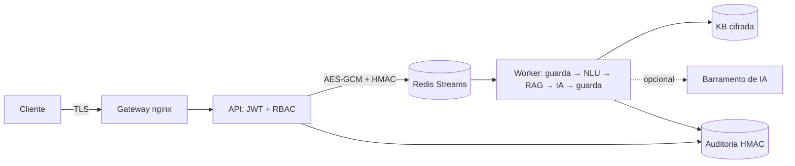

# 🛡️ Aegis — Assistente Virtual de Segurança da Informação

> Desafio DIO **"Construa Seu Assistente Virtual Com Inteligência Artificial"** levado ao limite: um assistente de **segurança defensiva** com **base de conhecimento curada e citada**, **barramento de mensagens cifrado**, **barramento de IA generativa** com múltiplos provedores, **defesa em profundidade** em 6 camadas, contêineres endurecidos, **pipeline DevSecOps** e um **banco de treinamento** de segurança.

## Os 6 passos do desafio

| # | Passo | Entrega neste repositório |
|---|-------|---------------------------|
| 1 | Documentação | [`docs/01-documentacao-agente.md`](docs/01-documentacao-agente.md) |
| 2 | Base de conhecimento | [`docs/02-base-conhecimento.md`](docs/02-base-conhecimento.md) · [`data/kb/`](data/kb/base_conhecimento.json) (37 itens) |
| 3 | Prompts | [`docs/03-prompts.md`](docs/03-prompts.md) · [`src/aegis/prompts.py`](src/aegis/prompts.py) |
| 4 | Aplicação funcional | API FastAPI + CLI + worker ([`src/aegis/`](src/aegis)) |
| 5 | Avaliação e métricas | [`docs/05-avaliacao-metricas.md`](docs/05-avaliacao-metricas.md) · [`eval/`](eval) · 63 testes |
| 6 | Pitch | [`docs/06-pitch.md`](docs/06-pitch.md) |
| ➕ | **Interface web** (chat com fontes, trilha de segurança) | `src/aegis/ui/` · [`docs/07-blueprint-interface.md`](docs/07-blueprint-interface.md) |
| ➕ | Arquitetura e ameaças | [`docs/04-arquitetura-seguranca.md`](docs/04-arquitetura-seguranca.md) |
| ➕ | **Banco de treinamento de segurança + pipelines** | [`data/treinamento/`](data/treinamento) |

## Arquitetura



**O que cada pergunta atravessa:** guarda de entrada (limites, prompt injection, pedido ofensivo) → DLP (mascara CPF, e-mail, cartão, segredos) → NLU (intenção, tópico, urgência, idioma) → recuperação BM25 com limiar de confiança → geração (LLM opcional, com citação obrigatória, ou resposta extrativa determinística) → DLP de saída + checagem de canário → resposta com fontes e próximos passos.

## Camadas de segurança
1. **Borda** — TLS 1.2/1.3, HSTS, rate limit, limite de corpo, métodos restritos.
2. **Aplicação** — JWT curto, RBAC, scrypt, validação estrita, cabeçalhos de segurança, erros genéricos.
3. **IA/conteúdo** — anti-injection, recusa ofensiva, DLP, isolamento do contexto, citações, canário, "não sei".
4. **Dados** — AES-256-GCM (barramento e base), HKDF por finalidade, HMAC, anti-replay, auditoria encadeada sem texto bruto.
5. **Infra** — 3 redes (`backend` interna), non-root, `read_only`, `cap_drop ALL`, gateway sem acesso à base.
6. **Cadeia de suprimentos** — gitleaks, Bandit, pip-audit, Trivy, SBOM, OPA, ZAP.

## Início rápido (sem Docker)

```bash
python -m venv .venv && source .venv/bin/activate   # Git Bash/Windows: source .venv/Scripts/activate
pip install -r requirements-dev.txt

make test      # 63 testes + cobertura
make eval      # avaliação fim a fim com gate
make cli       # converse com o assistente no terminal
make quiz      # simulado de segurança (21 questões)
make run       # interface em http://127.0.0.1:8000/ui/ (docs da API em /docs, só dev)
```

No modo `dev`, a API cria um usuário `demo` com senha aleatória exibida no log de inicialização.

```bash
TOKEN=$(curl -s localhost:8000/v1/auth/token -H 'content-type: application/json' \
  -d '{"username":"demo","password":"<senha do log>"}' | jq -r .access_token)
curl -s localhost:8000/v1/chat -H "Authorization: Bearer $TOKEN" -H 'content-type: application/json' \
  -d '{"question":"Como me proteger de SQL injection?"}' | jq
```

## Execução em contêineres (gateway + api + worker + redis)

```bash
python scripts/gen_keys.py >> .env                 # AEGIS_MASTER_KEY e REDIS_PASSWORD
python scripts/hash_password.py maria analista     # cole o JSON em AEGIS_USERS no .env
sh scripts/gen_dev_certs.sh                        # certificado autoassinado (somente dev)
docker compose up --build -d                       # https://localhost:8443
```

Para IA generativa, defina `AEGIS_LLM_CHAIN=anthropic,openai_compat` e as chaves correspondentes (ver `.env.example`). Sem isso, o assistente funciona 100% offline.

## Status de verificação

| Item | Estado |
|------|--------|
| Lógica, API, barramento, auditoria, guardrails, RAG | ✅ testados e executados (63 testes, ~84% de cobertura) |
| Lint (ruff) e SAST (Bandit) | ✅ executados sem achados |
| Barramento Redis Streams | ✅ testado com `fakeredis` (ida/volta e DLQ); ⚠️ validar contra um Redis real |
| Dockerfile (imagem) | ✅ construída e executada (usuário não-root, `/app/var` gravável); docker-compose e nginx: ⚠️ ainda não executados |
| GitHub Actions (qualidade, contêiner, Trivy, SBOM, OPA, ZAP) | ✅ executados em runner real; GitLab CI: ⚠️ YAML validado, não executado |
| Provedores Anthropic/OpenAI-compatível | ⚠️ testados só com provedores falsos (sem chamadas reais) |

As métricas de avaliação usam um conjunto escrito pelo mesmo autor da base: servem como teste de regressão (veja `docs/05`).

## Roadmap
Embeddings + reranking, mTLS e ACL de Redis por serviço, OIDC/SSO, painel de métricas (Prometheus), exportação da auditoria para armazenamento imutável e assinatura de imagens com cosign no CI.

## Estrutura
```
src/aegis/        código (security/, llm/, bus, pipeline, rag, nlu, main, worker, cli)
data/kb/          base de conhecimento (37 itens)
data/treinamento/ trilha, simulado (21 q) e pipelines (GitLab CI, política OPA)
eval/             conjunto dourado e avaliação com gate
tests/            63 testes
deploy/nginx/     gateway de borda
docs/             documentação dos 6 passos + arquitetura/ameaças
.github/workflows CI DevSecOps
```

Uso educacional e defensivo. Licença: [MIT](LICENSE).

## Autor

**José Wagner Blanco Júnior** — Principal AI Systems Architect

- GitHub: [josewagnerbljr-sys](https://github.com/josewagnerbljr-sys)
- LinkedIn: [blancoconsultoria](https://www.linkedin.com/in/blancoconsultoria)
- DIO: [consultoriablanco8](https://web.dio.me/users/consultoriablanco8)
- E-mail: consultoriablanco8@gmail.com
