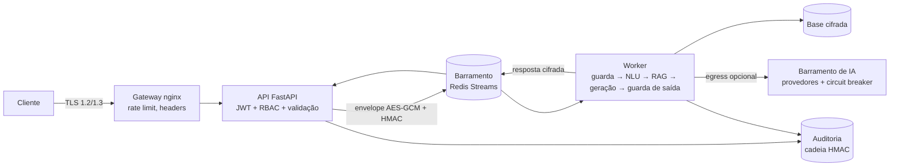

# 04 · Arquitetura e Modelo de Segurança

## Visão geral

## Camadas de defesa (defesa em profundidade)
| Camada | Controles implementados | Onde |
|--------|-------------------------|------|
| **1 · Borda** | TLS ≥ 1.2, HSTS, rate limit por IP/login, limite de corpo (16 KB), métodos restritos, docs ocultas | `deploy/nginx/nginx.conf` |
| **2 · Aplicação** | JWT HS256 (15 min, `iss/aud/exp` obrigatórios, `alg` fixo), RBAC, scrypt, esquema estrito (`extra=forbid`), rate limit por usuário, cabeçalhos de segurança, erros genéricos | `main.py`, `security/auth.py` |
| **3 · IA / conteúdo** | Anti-injection, recusa ofensiva, DLP entrada/saída, isolamento do contexto, citações obrigatórias, canário, limiar de confiança | `security/guardrails.py`, `pii.py`, `pipeline.py` |
| **4 · Dados** | AES-256-GCM no barramento e na base, HKDF por finalidade, HMAC do envelope, janela anti-replay, auditoria encadeada sem texto bruto | `bus.py`, `crypto.py`, `audit.py` |
| **5 · Infra** | 3 redes (edge / backend `internal` / egress), non-root, `read_only`, `cap_drop ALL`, `no-new-privileges`, limites de recursos, gateway sem acesso à base | `docker-compose.yml`, `Dockerfile` |
| **6 · Cadeia de suprimentos** | gitleaks, Bandit, pip-audit, Trivy, SBOM, política OPA, ZAP, versões fixas | `.github/workflows/ci.yml` |

## Barramento de mensagens seguro
Tópicos: `req.received → req.guarded → req.understood → req.retrieved → req.generated → res.<gateway>`.
- **Envelope**: `{t, i(trace), ts, ct, sig}`; `ct = AES-256-GCM(payload, AAD = tópico|trace|ts)`; `sig = HMAC-SHA256(mac_key, cabeçalho|ct)`.
- **Chaves independentes** (HKDF da chave-mestra): `bus-enc`, `bus-mac`, `kb`, `audit`, `jwt`, `canary`.
- **Entrega**: Redis Streams com consumer groups (balanceia workers; *at-least-once*), mensagens inválidas ou que falham vão para `aegis:dlq`.
- **Resposta roteada por instância** (`res.<id>`), para que a réplica certa da API receba o resultado.
- **Privilégio mínimo**: o gateway publica pedidos e lê respostas, mas **não tem a base nem os provedores**.

## Barramento de IA generativa
`LLMRouter` percorre os provedores (`AEGIS_LLM_CHAIN`), com timeout, circuit breaker (3 falhas → 30 s aberto) e fallback final para a resposta extrativa. Provedores: Anthropic e qualquer endpoint compatível com OpenAI (HTTPS obrigatório; `http` só em localhost). Erros nunca incluem o corpo da resposta.

## Modelagem de ameaças (STRIDE)
| Ameaça | Exemplo | Mitigação |
|--------|---------|-----------|
| **S**poofing | Token forjado (`alg=none`) | algoritmo fixo, `iss/aud/exp` exigidos; teste dedicado |
| **S** | Mensagem forjada no barramento | HMAC + AEAD; senha do Redis; rede interna |
| **T**ampering | Alterar a base ou o log | GCM na base; cadeia HMAC no log |
| **R**epudiation | Negar uma ação | auditoria de login, bloqueios e respostas (com `trace_id`) |
| **I**nfo disclosure | CPF/segredo vazando ao LLM ou nos logs | DLP de entrada e saída; log sem texto; canário |
| **D**oS | Flood, payload gigante, loop de LLM | nginx + app rate limit, 16 KB, timeouts, circuit breaker |
| **E**levation | Usuário comum chamando `/audit/verify` | RBAC (403) |
| Injeção (LLM01) | "Ignore as instruções…" | heurística + isolamento + citações + validação da saída |

## Riscos residuais (honestidade técnica)
- Heurísticas de injeção têm **falsos negativos** (paráfrases criativas) e podem ter falsos positivos; por isso existem as camadas seguintes.
- A auditoria detecta alterações no meio da cadeia, mas **não o truncamento do fim**: exporte para armazenamento externo imutável/SIEM.
- Rate limit da aplicação é por processo; com várias réplicas o limite global fica no gateway.
- Chave-mestra única: em produção, injete via cofre/KMS e planeje rotação (re-cifrar a base).
- Atrás do gateway, a aplicação enxerga o IP do proxy; o limite por IP real é do nginx.
- HS256 usa segredo compartilhado; para vários emissores, migre para RS256/EdDSA com JWKS.
- O mTLS entre serviços e o ACL por tópico do Redis (usuários distintos) estão no roadmap.
